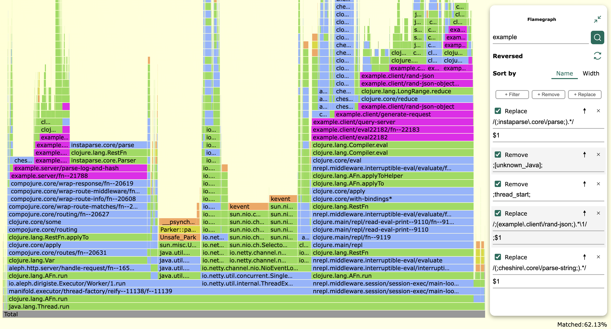

# clj-async-profiler [](https://dl.circleci.com/status-badge/redirect/gh/clojure-goes-fast/clj-async-profiler/tree/master) 

**clj-async-profiler** is an embedded high-precision performance profiler for
Clojure. Embedded means there is no software to install on your system, instead
you add the profiler to your application as a dependency. From there, you can
operate the profiler either programmatically or via a web UI. During profiling,
clj-async-profiler has very low overhead, so it is suitable for usage even in
highly loaded production scenarios.

clj-async-profiler presents the profiling results as an interactive
[flamegraph](http://www.brendangregg.com/flamegraphs.html). You can navigate the
flamegraph, query it, change parameters and adapt the results for easier
interpretation.




<p align = "center"><sup>
Example flamegraph. <a href="https://htmlpreview.github.io/?https://github.com/clojure-goes-fast/clj-async-profiler/blob/1.0.0/docs/flamegraph-example.html">Click</a> to open the interactive version.
</sup></p>

To collect the profiling data, clj-async-profiler utilizes
[async-profiler](https://github.com/jvm-profiling-tools/async-profiler) which is
a low overhead sampling profiler for Java. Current version of async-profiler
that is used by clj-async-profiler is
[2.8.2](https://github.com/jvm-profiling-tools/async-profiler/releases/tag/v2.8.2).

## Usage

clj-async-profiler is only supported on GNU/Linux and MacOS. On Linux, you need
to allow async-profiler to use kernel profiling data by setting these two
variables ([see
also](https://github.com/jvm-profiling-tools/async-profiler#basic-usage)):

```
sudo sysctl -w kernel.perf_event_paranoid=1
sudo sysctl -w kernel.kptr_restrict=0
```

Next, add `com.clojure-goes-fast/clj-async-profiler` to your dependencies. This
is the latest version:

[](https://clojars.org/com.clojure-goes-fast/clj-async-profiler)

**JDK11+:** you must start your application with JVM option
`-Djdk.attach.allowAttachSelf`, otherwise the profiling agent will not be able
to dynamically attach to the running process. For Leiningen, add `:jvm-opts
["-Djdk.attach.allowAttachSelf"]` to `project.clj`. For tools.deps, add the same
`:jvm-opts` to `deps.edn` or write `-J-Djdk.attach.allowAttachSelf` explicitly
in your REPL command.

`clj-async-profiler.core` exposes an all-in-one facade for generating profiling
flame graphs. The most common usage scenario looks like this:

```clojure
(require '[clj-async-profiler.core :as prof])

;; Profile the following expression:
(prof/profile (dotimes [i 10000] (reduce + (range i))))

;; The resulting flamegraph will be stored in /tmp/clj-async-profiler/results/
;; You can view the HTML file directly from there or start a local webserver:

(prof/serve-files 8080) ; Serve on port 8080
```

You can also start and stop the profiler manually with `prof/start` and
`prof/stop`.

Each profiling command accepts a map of options. See docstrings for each command
for the list of supported options.

Option map for each profiling command can have a `:pid` value. If it is
provided, an external JVM process with this PID will be sampled, otherwise the
current process is targeted.

For a detailed description of clj-async-profiler's more advanced features, check
the following blog posts:

- [Introduction](http://clojure-goes-fast.com/blog/profiling-tool-async-profiler/)
- [Tips, tricks, new features in 0.3.0](http://clojure-goes-fast.com/blog/clj-async-profiler-tips/)
- [Diffgraphs](http://clojure-goes-fast.com/blog/clj-async-profiler-040/)
- [Dynamic transforms](http://clojure-goes-fast.com/blog/clj-async-profiler-100/)

### Extra tuning

From [async-profiler
README](https://github.com/jvm-profiling-tools/async-profiler#restrictionslimitations):
It is highly recommended to use `-XX:+UnlockDiagnosticVMOptions
-XX:+DebugNonSafepoints` JVM flags. Without those flags the profiler will still
work correctly but results might be less accurate. Without these options, there
is a high chance that simple inlined methods will not appear in the profile.
When agent is attached at runtime, CompiledMethodLoad JVMTI event enables debug
info, but only for methods compiled after the event is turned on.

If you see stackframes like `/usr/lib/.../libjvm.so`, it means that you have to
install JDK debug symbols. E.g., on Ubuntu that would be the package
`openjdk-11-dbg`.

## Platform support

clj-async-profiler ships with the precompiled native libraries that
async-profiler itself
[distributes](https://github.com/jvm-profiling-tools/async-profiler#download).
These include:

- **Linux**: x64, x64 with musl libc (Alpine), aarch64 (arm64)
- **MacOS**: x64/aarch64 (universal binary)

To use clj-async-profiler on other [supported
platforms](https://github.com/jvm-profiling-tools/async-profiler#supported-platforms),
you should do the following:

1. Build
   [async-profiler](https://github.com/jvm-profiling-tools/async-profiler#building)
   for the desired platform.
2. Put the resulting `libasyncProfiler.so` in a place accessible by your JVM
   process (and which also allows code execution from).
3. Execute from Clojure:

   ```clj
   (reset! clj-async-profiler.core/async-profiler-agent-path
           "/path/to/libasyncProfiler.so")
   ```

## License

async-profiler is distributed under Apache-2.0.
See [APACHE_PUBLIC_LICENSE](docs/APACHE_PUBLIC_LICENSE) file. The location of the original
repository
is
[https://github.com/jvm-profiling-tools/async-profiler](https://github.com/jvm-profiling-tools/async-profiler).

Copyright 2017-2022 Andrei Pangin

---

clj-async-profiler is distributed under the Eclipse Public License.
See [ECLIPSE_PUBLIC_LICENSE](docs/ECLIPSE_PUBLIC_LICENSE).

Copyright 2017-2022 Alexander Yakushev
